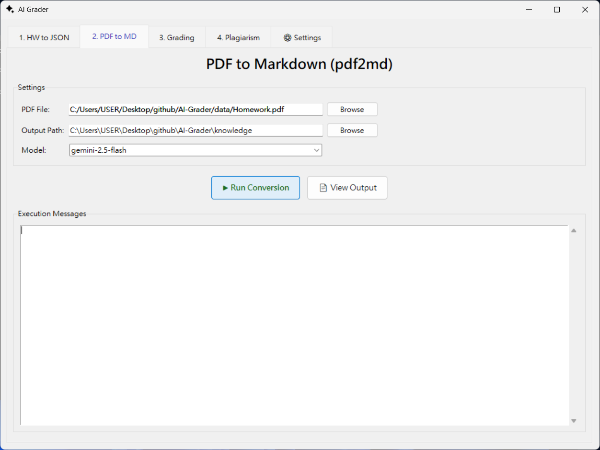
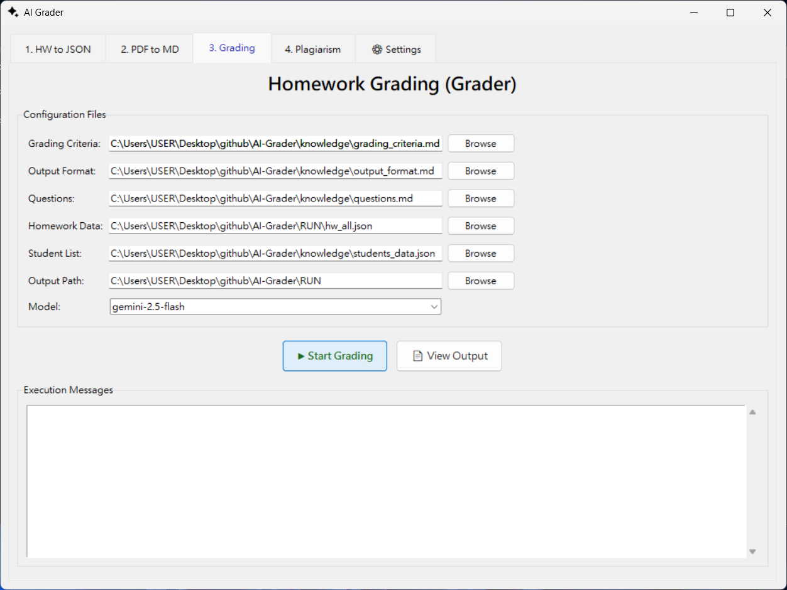
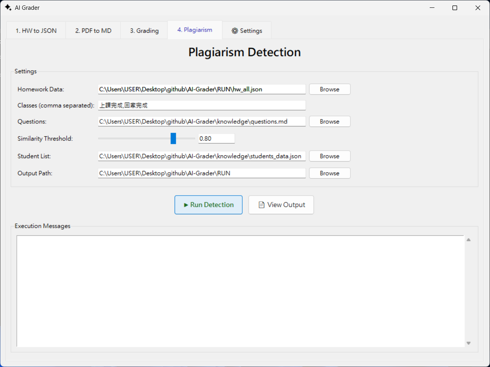
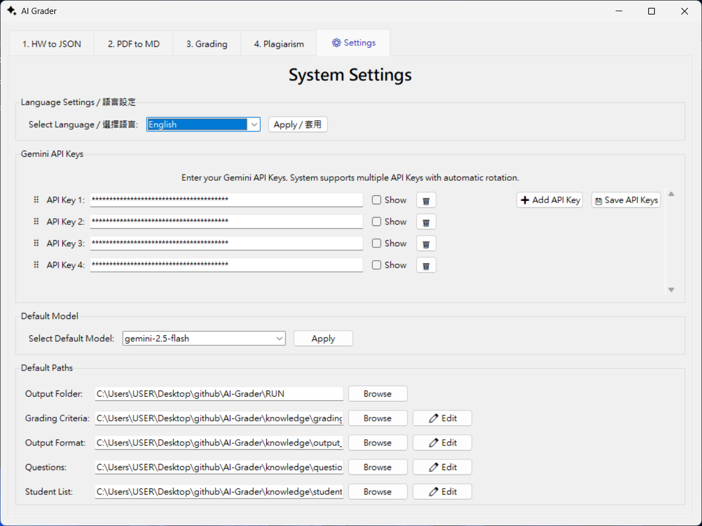

# AI Grader - Automated Homework Grading Tool

[繁體中文](README_zh-TW.md) | English

This repository contains an automated Python homework grading tool that uses a LLM (Large Language Model) to evaluate student Python assignments.

## Features

- 🤖 Automatic grading of student Python assignments
- 📝 Convert PDF problem statements to Markdown (supports LaTeX math)
- 📊 Produce complete grading results and statistics
- 📈 Export grades in a CSV format suitable for Excel
- 🔄 Automatic API key rotation to handle quota limits

## Project Structure

```
AI-Grader/
├── ai_grader/
│   ├── api_key_manager.py        # Gemini API key manager
│   ├── grader.py                 # Main program (calls Gemini for grading)
│   ├── pdf2md.py                 # PDF -> Markdown utility for questions
│   ├── gui_app.py                # GUI application for grading
│   ├── plagiarism_or_not.py      # Plagiarism checking tool
│   └── hw2json.py                # student submissions -> JSON
├── data/                         # Original student submission folders and problem PDFs
├── knowledge/                    # Questions, grading criteria, output format
│   ├── grading_criteria.md       # Grading criteria (customizable)
│   ├── output_format.md          # Expected JSON fields returned by the LLM (customizable)
│   ├── questions.md              # Questions (can be generated by pdf2md)
│   └── students_data.json        # Student data (ID, name)
├── RUN/                          # Program outputs
│   ├── grading_results.json      # Grading output (JSON)
│   ├── homework_scores.csv       # Grade sheet (CSV)
│   ├── hw_all.json               # Consolidated student submissions (from hw2json)
│   └── plagiarism_report.md      # Plagiarism report (Markdown)
├── test/
│   └── test_create_prompt.py     # Validate prompt content (no API call required)
└── run_app.bat                   # Script to run the GUI application
```

## Installation & Setup

1) Install dependencies (Windows PowerShell):

```powershell
cd c:\Users\USER\Desktop\AI-Grader
pip install -r requirements.txt
```

2) Configure Gemini API Key(s)

The project supports both a single environment variable `GEMINI_API_KEY` and multiple keys managed in a `.env` file for automatic rotation when quotas are exhausted.

By default the program will look for numbered keys `GEMINI_API_KEY_1, GEMINI_API_KEY_2, ...` (in numeric order). If none are found it will fallback to a single `GEMINI_API_KEY`.

Recommended approach: copy or rename `.env.example` to `.env` in the project root and fill in your keys:

Example (multiple keys):

```
GEMINI_API_KEY_1 = "your_first_key_here"
GEMINI_API_KEY_2 = "your_second_key_here"
GEMINI_API_KEY_3 = "your_third_key_here"
```

Or with a single key:

```
GEMINI_API_KEY = "your_key_here"
```

Behavior summary:
- The program loads `GEMINI_API_KEY_<n>` keys starting from 1 and records how many are loaded. If no numbered keys are found it will try `GEMINI_API_KEY`.
- On API errors like 429 / RESOURCE_EXHAUSTED (quota exhausted), the grader will automatically switch to the next registered key and retry.
- If all registered keys are exhausted, the process will report failure and stop retrying.

> [!NOTE]
> - Key rotation order follows the numeric index (1,2,3...). Fill them in according to the priority you want to use.
> - If only `GEMINI_API_KEY` is provided, the system still works but will not auto-rotate keys.
> - Manage API keys and quotas according to your provider’s policies.

- Obtain API keys here: https://aistudio.google.com/api-keys

3) Gemini Model Quotas

| Model | Category | RPM | TPM | RPD |
|-------|----------|-----|-----|-----|
| gemini-2.0-flash-exp | Text-out models | 0 / 10 | 0 / 250K | 0 / 50 |
| gemini-2.0-flash-lite | Text-out models | 0 / 30 | 0 / 1M | 0 / 200 |
| gemini-2.0-flash-preview-image-generation | Multi-modal generative models | 0 / 10 | 0 / 200K | 0 / 100 |
| gemini-2.0-flash | Text-out models | 0 / 15 | 0 / 1M | 0 / 200 |
| gemini-2.5-flash-lite | Text-out models | 0 / 15 | 0 / 250K | 0 / 1K |
| gemini-2.5-flash-tts | Multi-modal generative models | 0 / 3 | 0 / 10K | 0 / 15 |
| gemini-2.5-flash | Text-out models | 0 / 10 | 0 / 250K | 0 / 250 |
| gemini-2.5-pro | Text-out models | 0 / 2 | 0 / 125K | 0 / 50 |

## Quick Start

For Windows users, a batch script `run_app.bat` is provided for easy launching of the GUI application:

**Method 1: Double-click to run**
- Simply double-click `run_app.bat` in the project root directory to launch the GUI grading interface.

**Method 2: Command line**
```powershell
cd c:\Users\USER\Desktop\AI-Grader
.\run_app.bat
```

The script automatically:
- Activates the Python virtual environment
- Launches the GUI application (`gui_app.py`)

## GUI Interface Overview

The AI Grader GUI provides a user-friendly interface with multiple tabs for different functions:

### 1. Homework to JSON (hw2json)


Convert student homework submissions into JSON format:
- Configure class paths for different homework types
- Set student list and output paths
- One-click conversion of all submissions

### 2. PDF to Markdown (pdf2md)



Convert PDF problem statements to Markdown format:
- Select PDF file containing homework questions
- Choose output directory for generated Markdown
- Supports LaTeX math notation conversion
- Select Gemini model for conversion

### 3. Grading



Automatic homework grading interface:
- Configure grading criteria, output format, and questions files
- Load homework data (JSON) and student list
- Set output directory for grading results
- Select Gemini model for grading
- View execution messages in real-time
- Generate comprehensive grading reports

### 4. Plagiarism Detection



Detect potential plagiarism between student submissions:
- Configure homework data and student list
- Specify classes to compare (comma-separated)
- Adjust similarity threshold (0~1)
- Generate detailed plagiarism report

### 5. System Settings



Manage system configuration:
- **Language Settings**: Switch between English and Traditional Chinese
- **Gemini API Keys**: Add, manage, and save multiple API keys with automatic rotation
- **Default Model**: Select default Gemini model for all operations
- **Default Paths**: Configure default directories for output, grading criteria, output format, questions, and student list

## Customization

> [!TIP]
> Can use the [OpenAI Prompt Editor](https://platform.openai.com/chat/edit?models=gpt-5&optimize=true) to polish `knowledge/grading_criteria.md` and `knowledge/output_format.md`.
- Edit `knowledge/grading_criteria.md` to adjust scoring details.
- Edit `knowledge/output_format.md` to define the LLM's JSON response format.
- Change the `MODEL_NAME` in `ai_grader/grader.py` 、`ai_grader/plagiarism_or_not.py` to use a different Gemini model (default: `gemini-2.5-flash`).
- `knowledge/students_data.json` class lists which can be adjusted for your course.

## Testing (no API key required)

The `test/test_create_prompt.py` script generates a full LLM prompt and writes it to `test/test_output.md` without making any network calls:

```powershell
python test\test_create_prompt.py
```

## Troubleshooting

- "API key not configured" when running `grader.py`: ensure `.env` in the project root contains `GEMINI_API_KEY` or numbered keys.
- Connection errors: ensure the machine has internet access (Gemini API requires external connectivity).
- Missing student data: please confirm `knowledge/students_data.json` exists.
- Missing homework JSON: run `hw2json.py` first to generate `RUN/hw_all.json`.
- Missing questions Markdown: run `pdf2md.py` to generate `knowledge/questions.md`.

## Notes

- Grading time depends on the number of students and model latency. Test with a small subset first.
- Using LLMs may incur cost—monitor usage and billing for your account.

## Contributing & License

Contributions and issues are welcome. See the repository license for details.